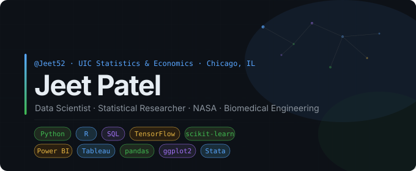

## Hi, I'm Jeet 👋

Statistics & Economics @ UIC | Data Science | ML | Actively seeking Data Science / Analytics roles in healthcare, aerospace, and AI.

## 🔭 What I'm working on
- **NASA MIRO** — Analyzing recycled HDPE composites for 3D printing in space using factorial ANOVA and Power BI dashboards
- **Lujan Lab** — Modeling addiction and decision-making patterns via tensor computational analysis on EEG data
- **Wearable Tech Lab** — Building sensor accuracy heatmaps and Bland–Altman analyses for intra-oral stroke rehab devices

## 🏆 Highlights
- 🥇 1st Place — SparkHacks 2025 Favorite Challenge (built a social iOS app in Swift + Figma in 24hrs)
- 🏅 Chancellor's Student Service Award & Chancellor's Undergraduate Research Award
- 📊 Data Science Intern @ Sumptuous Data Science — random forest model outperformed logistic regression (64.5% vs 51.4% accuracy)

## 🛠️ Tech Stack
`Python` `R` `SQL` `Stata` `TensorFlow` `scikit-learn` `pandas` `ggplot2` `Power BI` `Tableau`

## 📫 Reach me
- 💼 [LinkedIn](https://linkedin.com/in/jeetpatel52)
- 🌐 [Portfolio](https://jeet52.github.io)
- 📧 jpate307@uic.edu

## 📊 GitHub Stats

